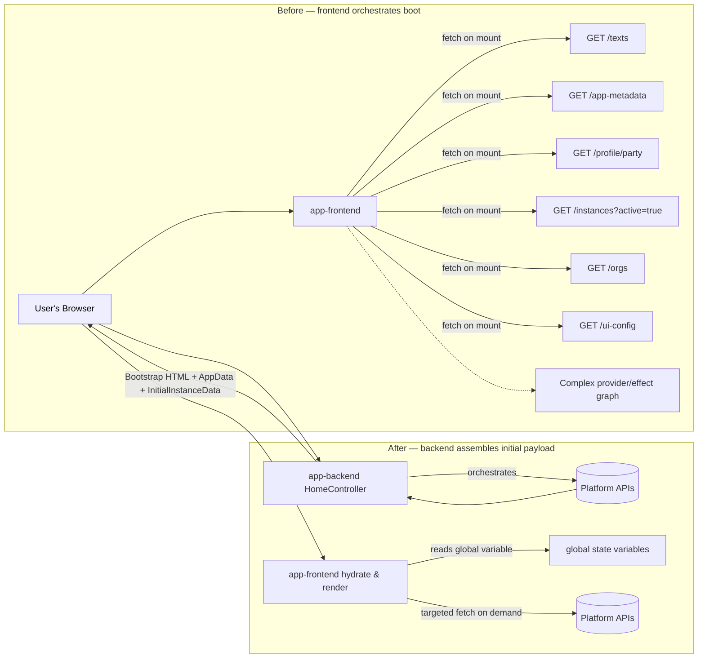

# ADR: Move most initial data loading to app-backend

- **Status:** Proposed
- **Date:** 2025-09-23
- **Owner:** Team Studio
- **Related:** Altinn/altinn-studio#16309 (Epic) ([GitHub][1])

## Context

Today `app-frontend` bootstraps by mounting a stack of query providers (TanStack Query), each fetching pieces of application/instance/party/config data on load. This creates:

- Many requests and duplicated invalidation logic
- Complex provider/effect nesting and brittle boot order
- Longer TTFB/TTI and heavier cognitive load for app developers

Epic #16309 proposes shifting _initial_ data orchestration to `app-backend` and delivering a consolidated payload to the client at bootstrap, reducing round trips and complexity. ([GitHub][1])

## Decision

We will:

1. **Generate the bootstrap HTML in `HomeController` (app-backend).**
   Backend takes ownership of serving the app shell (replaces handcrafted Index.cshtml).
2. **Adopt path-based routing (no `HashRouter`).**
   Backend resolves/serves deep links, delegating route rendering to `app-frontend`. Back-compat preserved for legacy hash URLs.
3. **Embed immutable “AppData” in the HTML.**
   Static, versionable, cross-variant data is serialized into a global (e.g., `window.AltinnAppData = {...}`) in the bootstrap page.
4. **Provide an “InitialInstanceData” bundle when opening an existing instance.**
   When backend detects an instance context, it embeds (or exposes via single endpoint) the static-at-boot instance data adjacent to `AppData`, so the client does not immediately refetch/invalidate. Further interactions use targeted APIs. ([GitHub][1])
5. **Remove RuleHandler/RuleConfiguration in this major.**
   Do not migrate them to the new boot flow (handled by separate task).

In scope: catalog and migrate all initial queries across stateless, stateless-anon, and stateful apps. Out of scope: data that must be updated _after_ boot.



## Rationale

- **Performance:** Fewer requests and no waterfall; better TTFB/TTI by shipping what the app needs up front.
- **Simplicity:** One place orchestrates initial data; frontend boot becomes deterministic.
- **Reliability:** Backend can decide what to load based on route/instance/party and enforce pagination/limits.

## Considered Options

1. **Status quo (frontend-orchestrated queries).**
   Rejected: retains complexity and network overhead.
2. **Bulk endpoints.**
   Rejected: increases backend complexity without clear benefit vs app-backend controller.

## Technical Notes (non-normative)

- **Bootstrap contract**

  ```html
  <script
    id="__appdata"
    type="application/json"
  >
    { ... AppData ... }
  </script>
  <script
    id="__initialInstanceData"
    type="application/json"
  >
    { ... } <!-- present only when opening an instance -->
  </script>
  <script>
    window.AltinnAppData = JSON.parse(document.getElementById('__appdata').textContent);
  </script>
  <script>
    window.AltinnInitialInstanceData = JSON.parse(
      document.getElementById('__initialInstanceData')?.textContent || 'null',
    );
  </script>
  ```

- **Routing:**
  - Backend maps `/` `/instances/:id/*` `/tasks/:taskId` etc. to a single `HomeController` action that embeds the correct initial payload and serves static assets.
  - Legacy `/#/...` routes: frontend redirects to updated routes.

- **Pagination upgrades:**
  - Add pagination on _active instances_ and _parties_ APIs as specified in tasks. Cursor-based preferred.

## Consequences

**Positive**

- Fewer network round trips at boot; smaller provider graph in UI.
- Clearer ownership boundaries: backend decides _what_; frontend renders _how_.
- Easier to test: snapshot input JSON → deterministic initial UI.

**Negative / Trade-offs**

- Slightly more logic in backend (must maintain schema for `AppData`/`InitialInstanceData`).
- Coordinated deploys required when the bootstrap contract changes.
- Initial HTML grows; ensure gzip/brotli and avoid embedding large option lists—keep those via APIs.

## Security & Compliance

- Ensure embedded data contains only what the current principal may see.

## Rollout Plan

1**Route migration:** enable path-based routing; ship redirects for legacy hash URLs; validate deep links.
2**Delete old providers/effects** and RuleHandler/RuleConfiguration.
3**Docs & templates:** update app templates and docs; provide migration guide for app owners.

## Impacted Areas

- `app-backend`: `HomeController`, payload assemblers, auth.
- `app-frontend`: routing, bootstrapping, removal of nested providers.
- APIs: instances list, parties list (add pagination).
- `app-template`: must be updated to support new loading.

## Open Questions

- Which option sources (datalists) are always API-fetched vs allowed to be embedded for tiny lists? (Epic notes say datalist+options stay API. Confirm.)
- Error UX if embedded payload fails to parse (serve minimal shell with error boundary?).
- What consequences does removing index.cshtml have and how should we support existing modifications that apps have implemented?

## Acceptance Criteria

- Boot of stateless and stateful apps requires ≤ 2 requests (HTML + assets) before first interactive paint (excluding datalist/options APIs).
- No client refetch for data already embedded at boot.
- Path URLs work for all previously supported deep links; legacy hashes redirect.
- Parties/instances APIs expose tested pagination; UI consumes it.
- Update RuleHandler/RuleConfiguration to mention that this functionality will be removed in future versions.

**Sources:** Epic details and tasks from Altinn/altinn-studio issue #16309. ([GitHub][1])

[1]: https://github.com/Altinn/altinn-studio/issues/16309 'Move most initial data loading to app-backend · Issue #16309 · Altinn/altinn-studio · GitHub'
