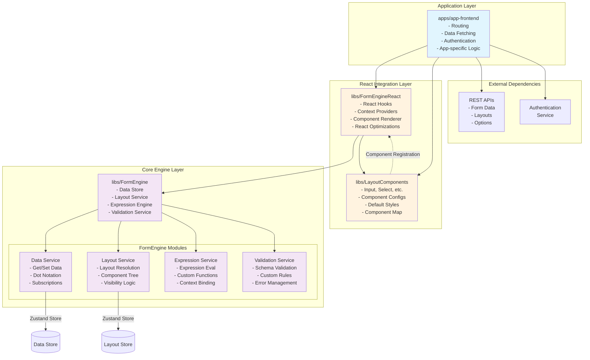
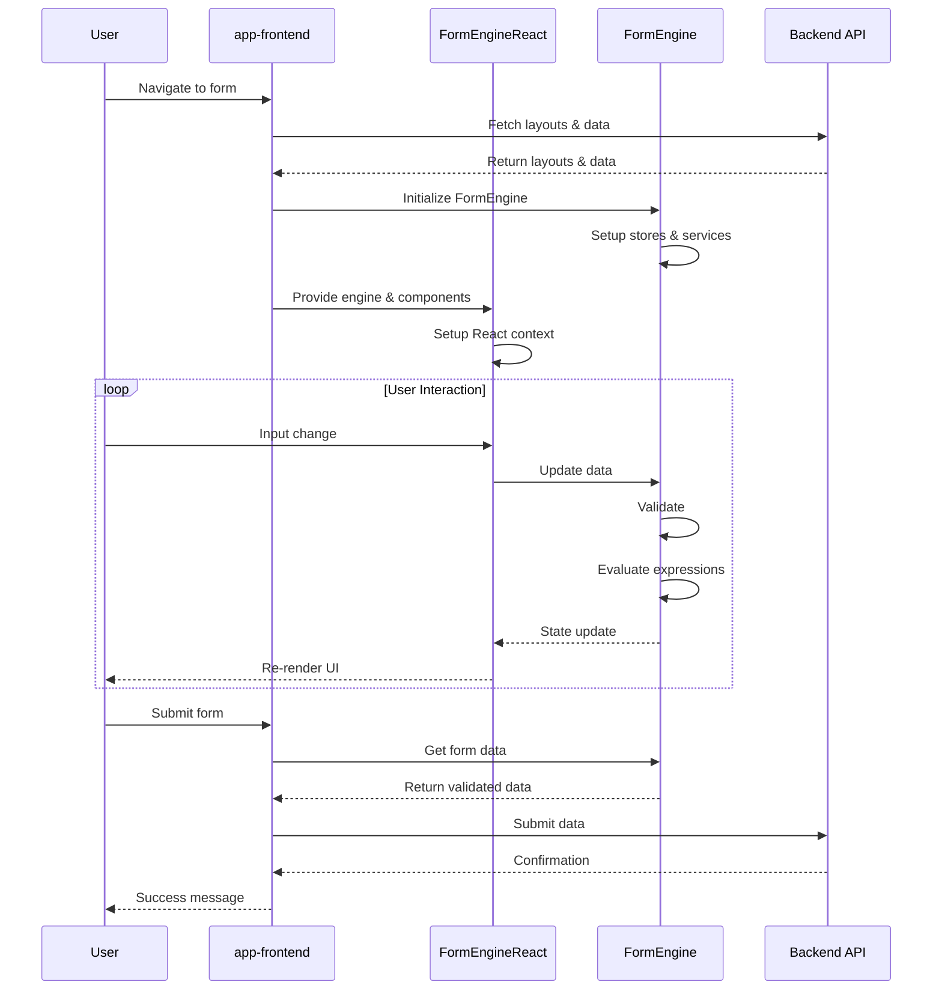

# Product Requirements Document: Altinn Form Engine Library Architecture

## Executive Summary

This PRD outlines the refactoring of the Altinn app-frontend-react monolithic application into a modular, framework-agnostic library architecture. The goal is to create reusable, maintainable, and extensible libraries that can be consumed by different applications while maintaining clear separation of concerns.

## Problem Statement

The current application architecture in `src/` is tightly coupled, making it difficult to:
- Reuse form logic across different frameworks
- Test components in isolation
- Extend or override specific functionality
- Maintain clear boundaries between business logic and UI
- Share form engine capabilities with other projects

## Solution Overview

Decompose the application into four core libraries:

1. **@libs/FormEngine** - Framework-agnostic core engine
2. **@libs/FormEngineReact** - React adapter for the form engine
3. **@libs/LayoutComponents** - React component library
4. **@apps/app-frontend** - Application layer for routing and data fetching

## Architecture Diagram



## Data Flow Diagram



## Architecture Design

### 1. @libs/FormEngine (Core Engine)

**Purpose**: Framework-agnostic form state management and business logic

**Responsibilities**:
- Data store management (using Zustand vanilla)
- Layout resolution and processing
- Expression evaluation
- Validation logic
- State synchronization
- Event handling

**Key Modules**:
```typescript
// Core interfaces
interface FormEngine {
  // Initialization
  initialize(config: FormEngineConfig): void;
  
  // Data Management
  data: DataService;
  
  // Layout Management
  layout: LayoutService;
  
  // Expression Engine
  expressions: ExpressionService;
  
  // Validation
  validation: ValidationService;
  
  // Events
  on(event: string, handler: Function): void;
  emit(event: string, payload: any): void;
}

interface FormEngineConfig {
  layouts: LayoutCollection;
  dataModel?: DataObject;
  schema?: JSONSchema7;
  expressions?: ExpressionConfig;
  validations?: ValidationConfig;
}
```

**File Structure**:
```
libs/FormEngine/
├── index.ts                    # Main export and FormEngine class
├── types.ts                    # Shared types and interfaces
├── modules/
│   ├── data/
│   │   ├── data.store.ts      # Zustand store for data
│   │   └── data.service.ts    # Data manipulation service
│   ├── layout/
│   │   ├── layout.store.ts    # Layout state management
│   │   └── layout.service.ts  # Layout resolution logic
│   ├── expression/
│   │   └── expression.service.ts # Expression evaluation
│   └── validation/
│       └── validation.service.ts # Validation logic
└── utils/
    └── dot-notation.ts        # Utility functions
```

### 2. @libs/FormEngineReact (React Adapter)

**Purpose**: React-specific integration layer for FormEngine

**Responsibilities**:
- React hooks for FormEngine integration
- Context providers
- Component rendering orchestration
- React-specific optimizations
- Event to React state bridging

**Key Components**:
```typescript
// Main provider component
interface FormEngineProviderProps {
  engine: FormEngine;
  componentMap: ComponentMap;
  children: React.ReactNode;
}

// Hook interfaces
interface FormEngineHooks {
  useFormData: (path?: string) => [any, (value: any) => void];
  useValidation: (componentId: string) => ValidationResult;
  useExpression: (expression: Expression) => any;
  useLayout: () => ResolvedLayout;
  useComponent: (componentId: string) => ResolvedComponent;
}

// Component renderer
interface FormRendererProps {
  pageId: string;
  componentOverrides?: Partial<ComponentMap>;
}
```

**File Structure**:
```
libs/FormEngineReact/
├── index.ts                    # Main exports
├── FormEngineProvider.tsx     # Context provider
├── FormRenderer.tsx           # Main renderer component
├── hooks/
│   ├── useFormData.ts
│   ├── useValidation.ts
│   ├── useExpression.ts
│   └── useLayout.ts
├── components/
│   ├── ComponentRenderer.tsx  # Dynamic component renderer
│   └── RepeatingGroup.tsx    # Repeating group handler
└── utils/
    └── react-bridge.ts        # React-FormEngine bridge utilities
```

### 3. @libs/LayoutComponents (Component Library)

**Purpose**: Reusable React components for form layouts

**Responsibilities**:
- Individual form components (Input, Select, etc.)
- Component configuration schemas
- Default styling
- Accessibility features
- Component registration map

**Component Structure**:
```typescript
// Component map type
type ComponentMap = Record<string, ComponentDefinition>;

interface ComponentDefinition {
  component: React.ComponentType<any>;
  config: ComponentConfig;
  validator?: ValidationFunction;
}

// Export structure
export const defaultComponentMap: ComponentMap = {
  'Input': { component: InputComponent, config: inputConfig },
  'Select': { component: SelectComponent, config: selectConfig },
  // ... more components
};
```

**File Structure**:
```
libs/LayoutComponents/
├── index.ts                    # Main export with component map
├── types.ts                    # Component types
├── components/
│   ├── Input/
│   │   ├── Input.tsx
│   │   ├── Input.config.ts
│   │   └── Input.module.css
│   ├── Select/
│   │   ├── Select.tsx
│   │   ├── Select.config.ts
│   │   └── Select.module.css
│   └── ... (other components)
├── base/
│   ├── BaseComponent.tsx      # Base component class
│   └── BaseConfig.ts          # Base configuration
└── utils/
    └── component-utils.ts
```

### 4. Application Layer (@apps/app-frontend)

**Purpose**: Full Altinn application implementation using the form libraries

**Responsibilities**:
- Application routing and navigation
- API integration and data fetching
- Authentication and authorization
- Instance management
- Process flow orchestration
- Custom business logic
- Error handling and recovery

**Detailed Structure**:
```
apps/app-frontend/
├── src/
│   ├── main.tsx                    # Application entry point
│   ├── App.tsx                     # Root component
│   ├── router.tsx                  # Route configuration
│   ├── api/
│   │   ├── client.ts              # API client setup
│   │   ├── instances.ts           # Instance API calls
│   │   ├── data.ts                # Data API calls
│   │   ├── layouts.ts             # Layout fetching
│   │   └── process.ts             # Process API
│   ├── pages/
│   │   ├── Landing/               # Landing page
│   │   ├── Instance/              # Instance pages
│   │   │   ├── InstanceRouter.tsx
│   │   │   ├── FormPage.tsx
│   │   │   ├── Summary.tsx
│   │   │   └── Receipt.tsx
│   │   └── Error/                 # Error pages
│   ├── features/
│   │   ├── auth/                  # Authentication
│   │   │   ├── AuthProvider.tsx
│   │   │   └── useAuth.ts
│   │   ├── instance/              # Instance management
│   │   │   ├── InstanceProvider.tsx
│   │   │   ├── useInstance.ts
│   │   │   └── instanceLoader.ts
│   │   ├── process/               # Process flow
│   │   │   ├── ProcessProvider.tsx
│   │   │   └── useProcess.ts
│   │   └── attachments/           # File handling
│   │       ├── AttachmentProvider.tsx
│   │       └── useAttachments.ts
│   ├── components/
│   │   ├── Layout/                # App layout components
│   │   ├── Navigation/            # Navigation components
│   │   └── custom/                # Custom form components
│   ├── hooks/
│   │   ├── useFormEngine.ts      # FormEngine initialization
│   │   ├── useApiData.ts         # Data fetching hooks
│   │   └── useNavigation.ts      # Navigation logic
│   └── utils/
│       ├── formConfig.ts         # Form configuration
│       └── errorHandling.ts      # Error utilities
├── public/
├── package.json
├── tsconfig.json
└── vite.config.ts
```

**Key Implementation Details**:

```typescript
// App.tsx - Root application component
import { FormEngine } from '@libs/FormEngine';
import { FormEngineProvider } from '@libs/FormEngineReact';
import { defaultComponentMap } from '@libs/LayoutComponents';
import { CustomInput } from './components/custom/CustomInput';

function App() {
  return (
    <BrowserRouter>
      <AuthProvider>
        <Routes>
          <Route path="/" element={<Landing />} />
          <Route path="/:org/:app/*" element={<InstanceRouter />} />
        </Routes>
      </AuthProvider>
    </BrowserRouter>
  );
}

// InstanceRouter.tsx - Instance routing logic
function InstanceRouter() {
  const { org, app } = useParams();
  const engine = useFormEngine();
  
  // Custom component overrides
  const componentMap = {
    ...defaultComponentMap,
    'CustomInput': CustomInput,
    // Add app-specific components
  };
  
  return (
    <FormEngineProvider engine={engine} componentMap={componentMap}>
      <InstanceProvider>
        <Routes>
          <Route path="instance/:partyId/:instanceId" element={<InstanceLayout />}>
            <Route index element={<FormPage />} />
            <Route path="summary" element={<Summary />} />
            <Route path="receipt" element={<Receipt />} />
          </Route>
        </Routes>
      </InstanceProvider>
    </FormEngineProvider>
  );
}

// useFormEngine.ts - FormEngine initialization hook
function useFormEngine() {
  const [engine] = useState(() => new FormEngine());
  const { org, app, instanceId } = useParams();
  
  useEffect(() => {
    async function initializeEngine() {
      // Fetch layouts
      const layouts = await api.getLayouts(org, app);
      
      // Fetch form data if editing
      let data = {};
      if (instanceId) {
        data = await api.getData(org, app, instanceId);
      }
      
      // Fetch data model schema
      const schema = await api.getDataModelSchema(org, app);
      
      // Initialize engine
      engine.initialize({
        layouts,
        dataModel: data,
        schema,
        expressions: {
          functions: customExpressionFunctions
        }
      });
    }
    
    initializeEngine();
  }, [org, app, instanceId]);
  
  return engine;
}

// FormPage.tsx - Main form rendering page
function FormPage() {
  const { currentPage } = useProcess();
  const { saveData } = useInstance();
  const engine = useFormEngine();
  
  // Auto-save functionality
  useEffect(() => {
    const unsubscribe = engine.data.subscribe(
      debounce((data) => {
        saveData(data);
      }, 2000)
    );
    
    return unsubscribe;
  }, []);
  
  return (
    <div className="form-container">
      <ProcessNavigation />
      <FormRenderer pageId={currentPage} />
      <FormActions />
    </div>
  );
}

// API Client setup
class ApiClient {
  private baseUrl: string;
  
  async getLayouts(org: string, app: string): Promise<LayoutCollection> {
    const response = await fetch(`${this.baseUrl}/${org}/${app}/layouts`);
    return response.json();
  }
  
  async getData(org: string, app: string, instanceId: string): Promise<DataObject> {
    const response = await fetch(`${this.baseUrl}/${org}/${app}/instances/${instanceId}/data`);
    return response.json();
  }
  
  async saveData(org: string, app: string, instanceId: string, data: DataObject): Promise<void> {
    await fetch(`${this.baseUrl}/${org}/${app}/instances/${instanceId}/data`, {
      method: 'PUT',
      body: JSON.stringify(data),
      headers: { 'Content-Type': 'application/json' }
    });
  }
  
  async processNext(org: string, app: string, instanceId: string): Promise<ProcessState> {
    const response = await fetch(`${this.baseUrl}/${org}/${app}/instances/${instanceId}/process/next`, {
      method: 'PUT'
    });
    return response.json();
  }
}
```

**Environment Configuration**:
```typescript
// config/environment.ts
export const config = {
  apiBaseUrl: import.meta.env.VITE_API_BASE_URL || 'https://api.altinn.no',
  authUrl: import.meta.env.VITE_AUTH_URL || 'https://auth.altinn.no',
  cdnUrl: import.meta.env.VITE_CDN_URL || 'https://cdn.altinn.no',
  features: {
    autoSave: import.meta.env.VITE_FEATURE_AUTOSAVE === 'true',
    offlineMode: import.meta.env.VITE_FEATURE_OFFLINE === 'true'
  }
};
```

## API Design

### FormEngine API

```typescript
class FormEngine {
  // Initialization
  constructor(config?: Partial<FormEngineConfig>);
  initialize(config: FormEngineConfig): void;
  reset(): void;
  
  // Data operations
  getData(path?: string): any;
  setData(path: string, value: any): void;
  setDataBatch(updates: Record<string, any>): void;
  
  // Layout operations
  getLayout(pageId: string): ResolvedLayout;
  getComponent(componentId: string): ResolvedComponent;
  updateComponentVisibility(componentId: string, visible: boolean): void;
  
  // Validation
  validate(): ValidationResult[];
  validateComponent(componentId: string): ValidationResult;
  clearValidation(componentId?: string): void;
  
  // Expressions
  evaluateExpression(expr: Expression, context?: any): any;
  registerFunction(name: string, fn: Function): void;
  
  // Events
  on(event: FormEngineEvent, handler: EventHandler): void;
  off(event: FormEngineEvent, handler: EventHandler): void;
  emit(event: FormEngineEvent, payload?: any): void;
  
  // State
  getState(): FormEngineState;
  subscribe(listener: StateListener): Unsubscribe;
}
```

### React Hooks API

```typescript
// Data hook
const [value, setValue] = useFormData('person.firstName');

// Validation hook
const { errors, isValid, validate } = useValidation('input-field-1');

// Expression hook
const isVisible = useExpression(['equals', ['dataModel', 'person.age'], 18]);

// Component hook
const component = useComponent('input-field-1');

// Form state hook
const { isValid, isDirty, isSubmitting } = useFormState();
```

## Migration Strategy

### Phase 1: Core Engine (Weeks 1-2)
1. Create FormEngine core with data store
2. Implement layout service
3. Add expression evaluation
4. Build validation service

### Phase 2: React Adapter (Weeks 3-4)
1. Create FormEngineProvider
2. Implement core hooks
3. Build FormRenderer
4. Add optimization layers

### Phase 3: Component Library (Weeks 5-6)
1. Migrate existing components
2. Standardize component configs
3. Create component map
4. Add documentation

### Phase 4: Application Migration (Weeks 7-8)
1. Set up app-frontend structure
2. Migrate routing logic
3. Move API calls to app layer
4. Implement instance management
5. Add process flow
6. Test end-to-end flows

### Phase 5: Feature Parity (Weeks 9-10)
1. Migrate attachments functionality
2. Add PDF generation
3. Implement summary pages
4. Add receipt functionality
5. Migrate custom validations

## Testing Strategy

### Unit Tests
- FormEngine core logic
- Individual services
- Component isolation tests
- Hook behavior tests
- API client methods

### Integration Tests
- FormEngine + React adapter
- Component rendering
- Data flow scenarios
- Expression evaluation
- Process flow

### E2E Tests
- Complete form flows
- Data persistence
- Validation scenarios
- Multi-page forms
- File uploads
- Process navigation

## Performance Considerations

1. **Memoization**: Use React.memo and useMemo for expensive computations
2. **Selective Updates**: Granular subscriptions to prevent unnecessary renders
3. **Lazy Loading**: Dynamic imports for large component sets
4. **Virtual Scrolling**: For large repeating groups
5. **Debouncing**: For validation and expression evaluation
6. **Code Splitting**: Route-based splitting in app-frontend

## Security Considerations

1. **Input Sanitization**: All user inputs sanitized before storage
2. **Expression Sandboxing**: Limited expression evaluation scope
3. **XSS Prevention**: React's built-in protection + additional sanitization
4. **Data Validation**: Schema validation before data operations
5. **Authentication**: Token-based auth with refresh logic
6. **CORS**: Proper CORS configuration for API calls

## Documentation Requirements

1. **API Documentation**: Full TypeScript definitions and JSDoc
2. **Component Storybook**: Interactive component documentation
3. **Integration Guide**: Step-by-step integration instructions
4. **Migration Guide**: From monolith to library architecture
5. **Example Applications**: Reference implementations
6. **Architecture Guide**: Detailed architecture documentation

## Success Metrics

1. **Code Reusability**: 80% of form logic shared across projects
2. **Bundle Size**: 
   - Core engine: < 100KB
   - Component library: < 200KB
   - App bundle: < 500KB initial load
3. **Performance**: 
   - < 16ms render time for form updates
   - < 100ms for expression evaluation
   - < 200ms for validation
4. **Test Coverage**: 
   - > 90% for core engine
   - > 80% for components
   - > 70% for application
5. **Developer Experience**: 
   - Setup time < 30 minutes
   - Hot reload < 2 seconds
   - Build time < 30 seconds

## Risks and Mitigations

| Risk | Impact | Mitigation |
|------|--------|------------|
| Breaking existing functionality | High | Comprehensive test suite, gradual migration, feature flags |
| Performance regression | Medium | Performance benchmarks, optimization phase, profiling |
| Complex integration | Medium | Clear documentation, example apps, developer guides |
| Version management | Low | Semantic versioning, clear changelog, deprecation policy |
| State synchronization issues | Medium | Robust testing, clear data flow, debugging tools |
| Bundle size growth | Medium | Tree shaking, code splitting, regular audits |

## Future Enhancements

1. **Framework Adapters**: Vue, Angular, Svelte adapters
2. **Advanced Features**: 
   - Conditional logic builder
   - Visual form designer
   - A/B testing support
3. **Plugins System**: Extensible architecture for custom features
4. **Offline Support**: Service worker integration, offline-first approach
5. **Real-time Collaboration**: Multi-user form editing
6. **AI Assistance**: Form filling suggestions, validation helpers
7. **Analytics Integration**: Form analytics and user behavior tracking
8. **Mobile SDK**: Native mobile implementations

## Conclusion

This architecture provides a clean separation of concerns, enabling:
- Framework independence for core logic
- Easy testing and maintenance
- Flexible component customization
- Clear upgrade paths
- Improved developer experience
- Scalable application development

The modular approach ensures that each library can evolve independently while maintaining compatibility through well-defined interfaces. The app-frontend serves as a reference implementation demonstrating best practices for consuming the libraries.